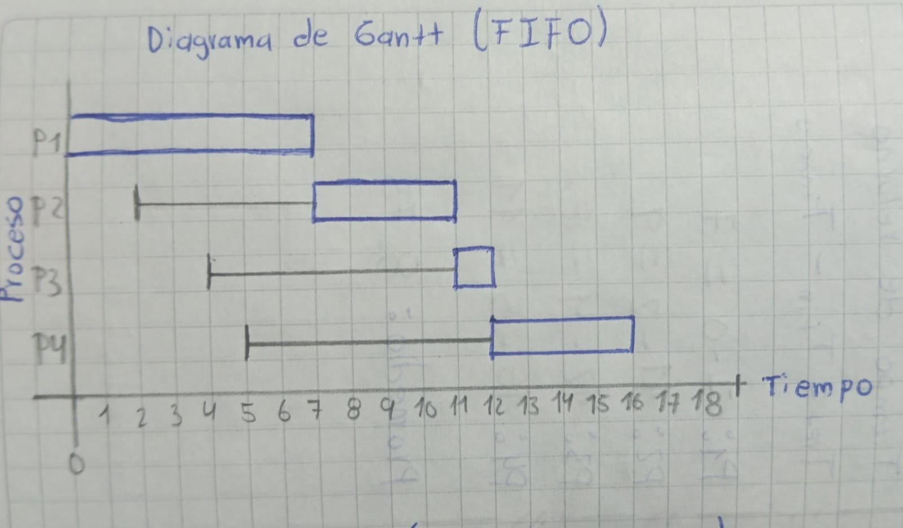
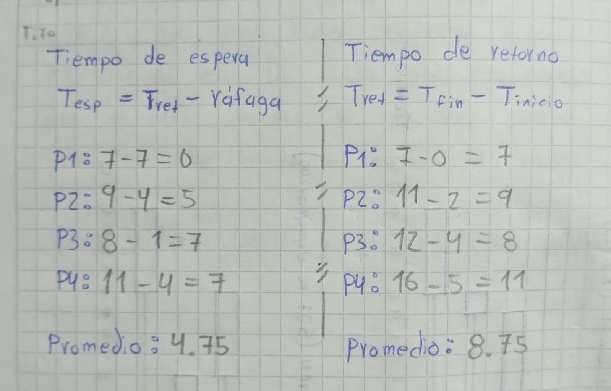
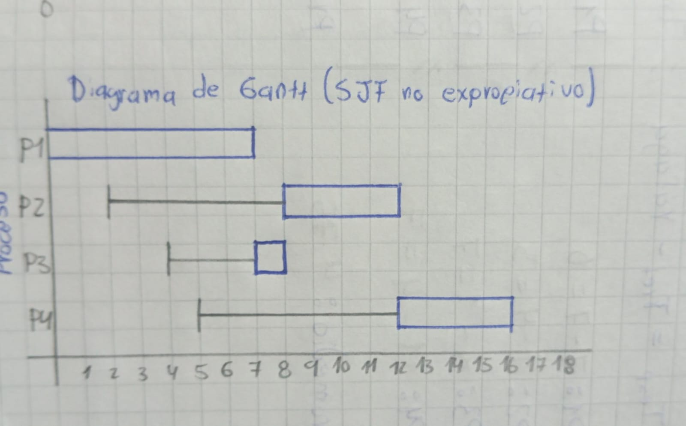
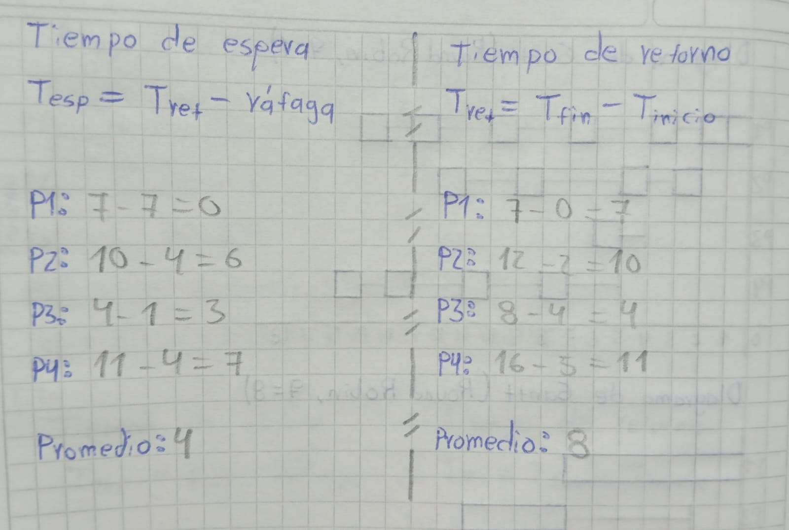
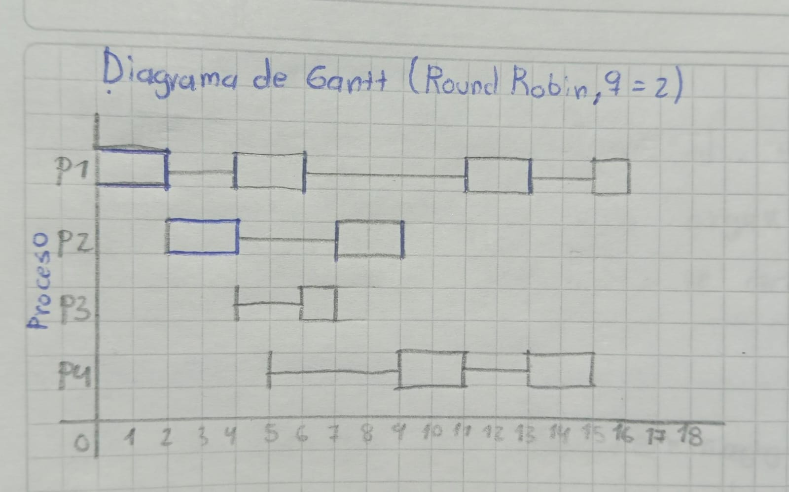
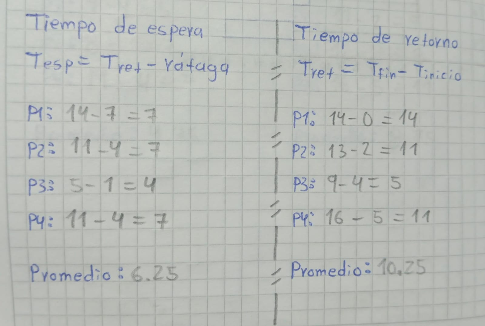
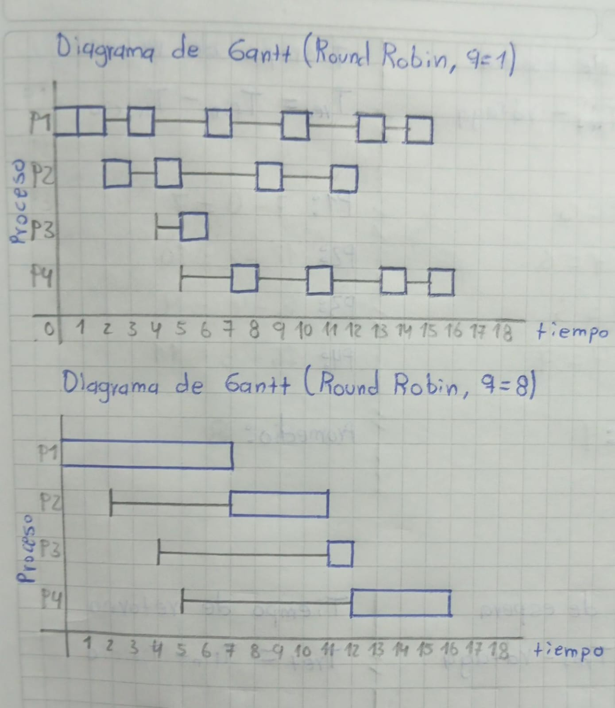

# Taller 6: Planificación de Procesos

Resolver a mano la planificación de un conjunto de procesos con FIFO, SJF no
expropiativo y Round Robin, comparar sus resultados y luego observar en el
sistema real cómo se reparte el procesador.

## Requisitos Previos

* Conceptos de planificación: algoritmos expropiativos vs. no expropiativos,
  tiempo de espera y tiempo de retorno.
* Herramientas de sistema `top`, `ps` y `renice` (incluidas en Linux).

---

## Contenido

Este taller no requiere compilar código en C. Consta de dos partes:

1. **En papel:** planificación del conjunto de procesos (P1-P4) con FIFO, SJF
   no expropiativo y Round Robin (quantum 2, 1 y 8), con sus diagramas de
   Gantt y tablas de tiempo de espera / tiempo de retorno.
2. **En la máquina:** observación de los procesos en ejecución y sus
   prioridades, y el efecto de `renice` sobre un proceso.

## Primera parte: diagramas y tiempos

Los diagramas de Gantt y las tablas de tiempos de espera / retorno están en
`diagramas/`.

**FIFO**




**SJF no expropiativo**




**Round Robin (quantum 2)**




**Round Robin: quantum 1 vs. quantum 8**



## Segunda parte: comandos usados

- Ver procesos en ejecución y su prioridad:
```bash
$ top
$ ps -eo pid,ni,pri,comm --sort=-pri | head
```

- Cambiar la amabilidad (nice) de un proceso en ejecución:
```bash
$ renice <valor> -p <PID>
```

## Entrega

- Diagramas de Gantt y tablas de tiempos, hechos a mano o en el computador.
- Respuestas a los puntos 3, 4 y 6 en `bitacora.md`.
